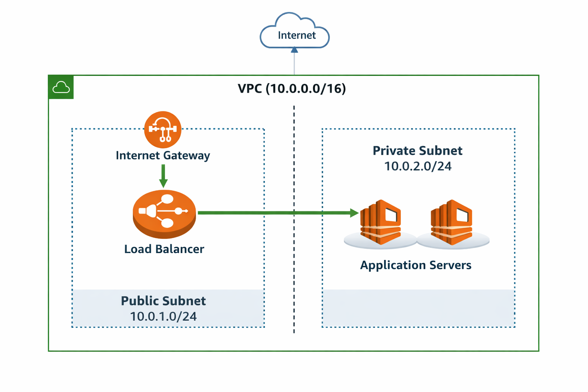

# Region and Availability Zone Architecture

## Region Choice
Since the primary users are in East Africa, the closest low-latency AWS region is:
- **eu-west-1 (Ireland)**  
It offers reliable performance and multiple Availability Zones (AZs).

## Multi-AZ Architecture Reasoning
Distributing resources across at least two AZs ensures:
- High availability (if one AZ fails, another serves traffic)
- Fault tolerance
- Load distribution
- Better resilience during outages

## Summary
- Region: `eu-west-1`
- Public subnets host load balancers
- Private subnets (in two AZs) host application servers

---

## **Evidence**
- Architecture reasoning documented in `/starter-kit/regions-azs.md`
- Multi-AZ referenced in network diagram 